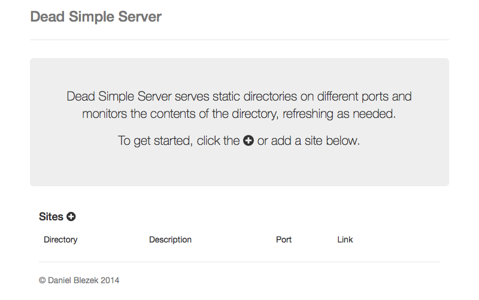
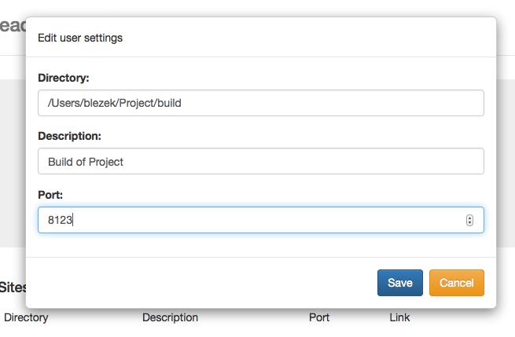
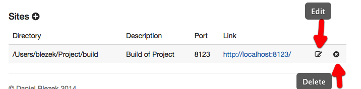

# dead-simple-server

> Live update for multiple directories of static files.

## Features
. Serve multiple directories on distinct ports
. Persistent configuration using [nedb](https://github.com/louischatriot/nedb). Simple configuration through http://localhost:8847

## What is it good for?
For developers/designers with multiple concurrent projects, dead-simple-server is a single point to configure independant web servers for static files.

## Install
```
npm install -g dead-simple-server
```

## Start 'er up
TL;DR
```bash
dead-simple-server
```

Visiting http://localhost:8847 will bring up the console page.  Multiple directories can be configured and served on different ports.

```bash
./dead-simple-server --help

  Usage: dead-simple-server [options]

  Options:

    -h, --help      output usage information
    -V, --version   output the version number
    -d, --database  Name of the database file, defaults to dss.db
    -p, --port      Port to run server on, defaults to 8847
    -q, --quiet     Do not open the control panel on startup
    -l, --logging   Amount of logging, one of 'silent', 'debug', or 'error', default is 'silent'
```

- `--database` specify a database file to use, defaults to `dss.db` in the current directory
- `--port` which port to start the web app, defaults to `8847` (http://localhost:8847)
- `--open` if you would like the web app to open at startup.  Each served directory is automatically opened in the default browser.
- `--logging` how much logging do you want?  Default is `silent`

## Configuration



New "sites" can be added by clicking the "+" on the configuration site.  A server listening at the specified port will be started and the a page opened up showing the contents of the directory.



In this example, the directory `/Users/blezek/Project/build` will be served on http://localhost:8123.  This configuration will be saved for the next run of `dead-simple-server`.



Directories can be edited or deleted.

## License
Copyright (c) 2014, Daniel Blezek,
All rights reserved.

Redistribution and use in source and binary forms, with or without modification, are permitted provided that the following conditions are met:

1. Redistributions of source code must retain the above copyright notice, this list of conditions and the following disclaimer.

2. Redistributions in binary form must reproduce the above copyright notice, this list of conditions and the following disclaimer in the documentation and/or other materials provided with the distribution.

3. Neither the name of the copyright holder nor the names of its contributors may be used to endorse or promote products derived from this software without specific prior written permission.

THIS SOFTWARE IS PROVIDED BY THE COPYRIGHT HOLDERS AND CONTRIBUTORS "AS IS" AND ANY EXPRESS OR IMPLIED WARRANTIES, INCLUDING, BUT NOT LIMITED TO, THE IMPLIED WARRANTIES OF MERCHANTABILITY AND FITNESS FOR A PARTICULAR PURPOSE ARE DISCLAIMED. IN NO EVENT SHALL THE COPYRIGHT HOLDER OR CONTRIBUTORS BE LIABLE FOR ANY DIRECT, INDIRECT, INCIDENTAL, SPECIAL, EXEMPLARY, OR CONSEQUENTIAL DAMAGES (INCLUDING, BUT NOT LIMITED TO, PROCUREMENT OF SUBSTITUTE GOODS OR SERVICES; LOSS OF USE, DATA, OR PROFITS; OR BUSINESS INTERRUPTION) HOWEVER CAUSED AND ON ANY THEORY OF LIABILITY, WHETHER IN CONTRACT, STRICT LIABILITY, OR TORT (INCLUDING NEGLIGENCE OR OTHERWISE) ARISING IN ANY WAY OUT OF THE USE OF THIS SOFTWARE, EVEN IF ADVISED OF THE POSSIBILITY OF SUCH DAMAGE.
